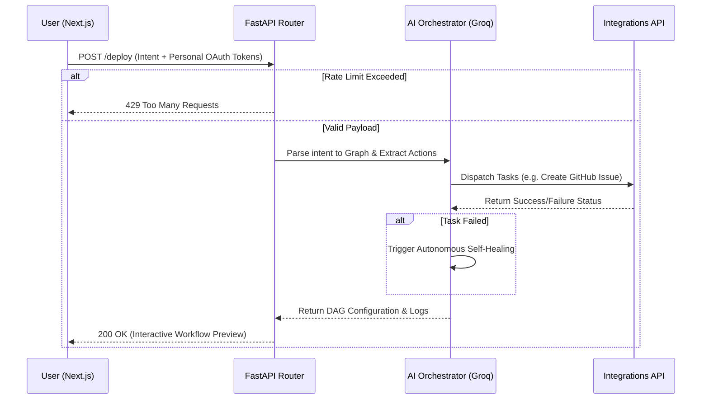

<div align="center">
  
  <h1>AutoFlow OS</h1>
  <p><strong>Autonomous AI Workflow Infrastructure</strong></p>
  <p>An AI-native automation ecosystem combining conversational AI, autonomous agents, and intelligent execution pipelines.</p>

  [](https://auto-flow-tau.vercel.app/)

  [](https://opensource.org/licenses/MIT)
  [](https://nextjs.org/)
  [](https://fastapi.tiangolo.com/)
  [](https://groq.com)
  
  <p>
    <a href="#sparkles-features">Features</a> •
    <a href="#rocket-quick-start">Quick Start</a> •
    <a href="#hammer_and_wrench-architecture">Architecture</a>
  </p>
</div>

---

## :sparkles: Features

AutoFlow enables you to describe automation tasks in plain English. The AI automatically:
- **Understands Intent**: Parses natural language requests using Groq's high-speed inference.
- **Plans Logic**: Compiles a Directed Acyclic Graph (DAG) of necessary actions.
- **Orchestrates Action**: Dispatches agents to execute pipeline nodes dynamically.

### 🔐 True OAuth 2.0 Integrations
AutoFlow supports **per-user personalization**. Instead of relying on a single global API key, users can securely connect their personal accounts. The Next.js API router securely exchanges authorization codes and manages scopes for 6 different providers:
- **GitHub**
- **Slack**
- **Notion**
- **Google (Gmail)**
- **Atlassian (Jira)**
- **Salesforce**

### 🧠 High-Velocity LLM Brain (Groq + Auto Healing)
The backend leverages **Groq (Llama 3.3 70B)** to generate the workflow DAGs and metadata in under a second. It includes built-in `User-Agent` spoofing to bypass Cloudflare Data Center blocks, ensuring flawless deployments on platforms like Render.
If a pipeline step fails, the system triggers an **Autonomous Self-Healing Protocol** that feeds the error trace back to the LLM to automatically rewrite and execute the fix in real-time.

### 🎨 Brutalist Frontend Experience
A production-grade, highly responsive UI built with **Next.js 15**, featuring:
- A custom 3D interactive particle grid that responds to scrolling and page state.
- Micro-animations powered by **Framer Motion**.
- A custom-built, interactive workflow Node Graph preview.

---

## :rocket: Quick Start

### 1. Clone the repository
```bash
git clone https://github.com/Adi3595/AutoFlow.git
cd AutoFlow
```

### 2. Start the Backend Engine (FastAPI)
Open a new terminal window:
```bash
cd backend
python -m venv venv

# Windows
.\venv\Scripts\activate
# Mac/Linux
source venv/bin/activate

# Install dependencies
pip install -r requirements.txt

# Create .env file and add your Groq API Key
echo "GROQ_API_KEY=your_groq_key" > .env
echo "BACKEND_CORS_ORIGINS='[\"http://localhost:3000\"]'" >> .env

# Start the secure orchestrator
python main.py
```
The API engine will run on `http://localhost:8000`.

### 3. Start the Frontend (Next.js)
```bash
cd frontend-next

# Link the frontend to the local backend engine
echo "NEXT_PUBLIC_API_URL=http://localhost:8000" > .env.local
echo "NEXT_PUBLIC_API_KEY=af_dev_secret_99" >> .env.local

npm install
npm run dev
```
The interactive UI will be available at `http://localhost:3000`.

---

## :hammer_and_wrench: Architecture



<div align="center">
  <p>Built for the future of Automation.</p>
</div>
