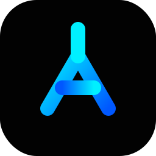
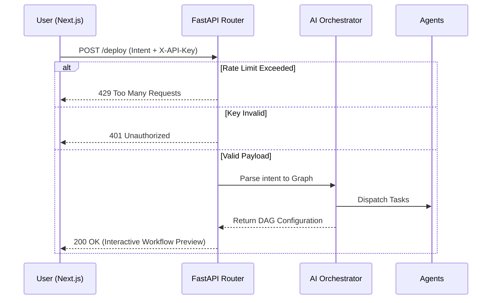

<div align="center">
  
  <h1>AutoFlow</h1>
  <p><strong>Autonomous Workflow Infrastructure</strong></p>
  <p>An AI-native automation ecosystem combining conversational AI, autonomous agents, and intelligent execution pipelines.</p>

  [](https://auto-flow-tau.vercel.app/)

  [](https://opensource.org/licenses/MIT)
  [](https://nextjs.org/)
  [](https://fastapi.tiangolo.com/)
  
  <p>
    <a href="#sparkles-features">Features</a> •
    <a href="#rocket-quick-start">Quick Start</a> •
    <a href="#hammer_and_wrench-architecture">Architecture</a> •
    <a href="#handshake-contributing">Contributing</a>
  </p>
</div>

---

## :sparkles: Features

AutoFlow enables you to describe automation tasks in plain English. The AI automatically:
- **Understands Intent**: Parses natural language requests.
- **Plans Logic**: Compiles a Directed Acyclic Graph (DAG).
- **Orchestrates Action**: Dispatches agents to execute pipeline nodes dynamically.

### Brutalist Frontend Experience
A production-grade, highly responsive UI built with **Next.js**, completely styled from scratch using modular CSS architecture and smooth micro-animations.

### Secure AI Backend
A **FastAPI** routing layer that serves as the brain of the ecosystem, equipped with:
- **Rate Limiting** (5 requests/min via `slowapi`)
- **Strict Validation** (Pydantic boundaries)
- **API Key Dependency Injection** (`X-API-Key`)

---

## :rocket: Quick Start

### 1. Clone the repository
```bash
git clone https://github.com/Adi3595/AutoFlow.git
cd AutoFlow
```

### 2. Start the Backend Engine (FastAPI)
Open a new terminal window:
```bash
cd backend
python -m venv venv

# Windows
.\venv\Scripts\activate
# Mac/Linux
source venv/bin/activate

# Install dependencies (includes slowapi, pydantic, fastapi)
pip install -r requirements.txt

# Start the secure orchestrator
python main.py
```
The API engine will run on `http://localhost:8000`.

### 3. Start the Frontend (Next.js)
```bash
cd frontend-next

# Ensure local env variables are set to point to the backend
echo "NEXT_PUBLIC_API_URL=http://localhost:8000" > .env.local
echo "NEXT_PUBLIC_API_KEY=af_dev_secret_99" >> .env.local

npm install
npm run dev
```
The interactive UI will be available at `http://localhost:3000`.

---

## :hammer_and_wrench: Architecture



### Directories

- `/frontend-next`: Next.js web application.
- `/backend`: Python API and LLM routing layer.

---

## :handshake: Contributing

We welcome contributions! Feel free to open issues or submit Pull Requests. 

1. Fork the Project
2. Create your Feature Branch (`git checkout -b feature/AmazingFeature`)
3. Commit your Changes (`git commit -m 'Add some AmazingFeature'`)
4. Push to the Branch (`git push origin feature/AmazingFeature`)
5. Open a Pull Request

---

<div align="center">
  <p>Built for the future of Automation.</p>
</div>
