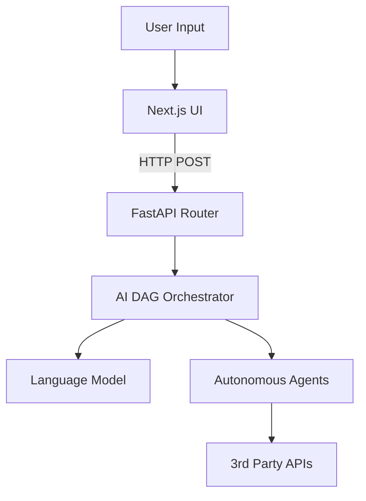

<div align="center">
  
  <h1>AutoFlow</h1>
  <p><strong>Autonomous Workflow Infrastructure</strong></p>
  <p>An AI-native automation ecosystem combining conversational AI, autonomous agents, and intelligent execution pipelines.</p>

  [](https://opensource.org/licenses/MIT)
  [](https://nextjs.org/)
  [](https://fastapi.tiangolo.com/)
  
  <p>
    <a href="#sparkles-features">Features</a> •
    <a href="#rocket-quick-start">Quick Start</a> •
    <a href="#hammer_and_wrench-architecture">Architecture</a> •
    <a href="#handshake-contributing">Contributing</a>
  </p>
</div>

---

## :sparkles: Features

AutoFlow enables you to describe automation tasks in plain English. The AI automatically:
- **Understands Intent**: Parses natural language requests.
- **Plans Logic**: Compiles a Directed Acyclic Graph (DAG).
- **Orchestrates Action**: Dispatches agents to execute pipeline nodes dynamically.

### Brutalist Frontend Experience
A production-grade, highly responsive UI built with **Next.js**, completely styled from scratch using modular CSS architecture and smooth micro-animations.

### AI Engine Backend
A **FastAPI** routing layer that serves as the brain of the ecosystem, intercepting intents and orchestrating Pydantic-validated pipelines.

---

## :rocket: Quick Start

### 1. Clone the repository
```bash
git clone https://github.com/Adi3595/AutoFlow.git
cd AutoFlow
```

### 2. Start the Frontend (Next.js)
```bash
cd frontend-next
npm install
npm run dev
```
The UI will be available at `http://localhost:3000`.

### 3. Start the Backend Engine (FastAPI)
Open a new terminal window:
```bash
cd backend
python -m venv venv

# Windows
.\venv\Scripts\activate
# Mac/Linux
source venv/bin/activate

pip install fastapi uvicorn "pydantic<2"
python main.py
```
The API engine will run on `http://localhost:8000`.

---

## :hammer_and_wrench: Architecture

<details>
<summary>Click to expand Architecture Graph</summary>



</details>

### Directories

- `/frontend-next`: Next.js web application.
- `/backend`: Python API and LLM routing layer.

---

## :handshake: Contributing

We welcome contributions! Feel free to open issues or submit Pull Requests. 
Please ensure that your code aligns with our strict typing (Pydantic) and minimalist frontend aesthetics.

1. Fork the Project
2. Create your Feature Branch (`git checkout -b feature/AmazingFeature`)
3. Commit your Changes (`git commit -m 'Add some AmazingFeature'`)
4. Push to the Branch (`git push origin feature/AmazingFeature`)
5. Open a Pull Request

---

<div align="center">
  <p>Built for the future of Automation.</p>
</div>
